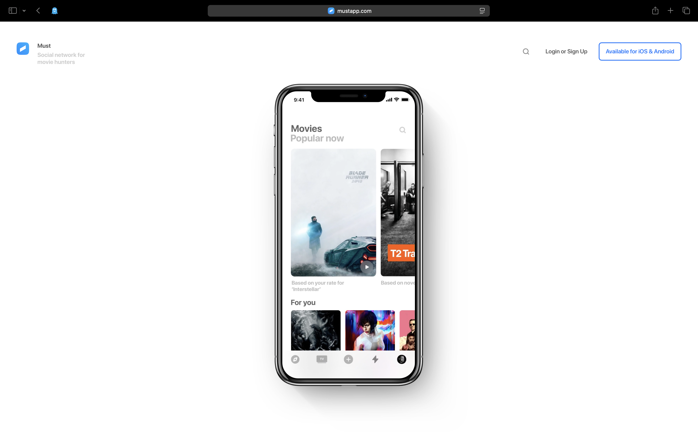

# must

This is a profile extractor for mustapp.com.
It exports your movie and show data:

`want` (movies you want to watch)

`watched` (movies you have watched)

`shows` (TV shows you follow)



https://mustapp.com

### 🔧 How to use

- Make sure you have Node.js installed.

- Install dependencies:

```bash
pnpm install
```

- Open the script (index.js) and set your Must username here:

```js
const MUST_USERNAME = "your_must_username";
```

- Run the extractor:
```js
pnpm run start
```

Your `want`, `watched`, and `shows` data will be exported automatically.

The extractor will create the following files inside a folder named `must_exports`:

`want.json` — movies you want to watch

`watched.json` — movies you have watched

`shows.json` — TV shows you follow